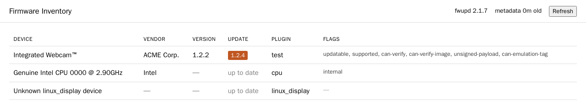
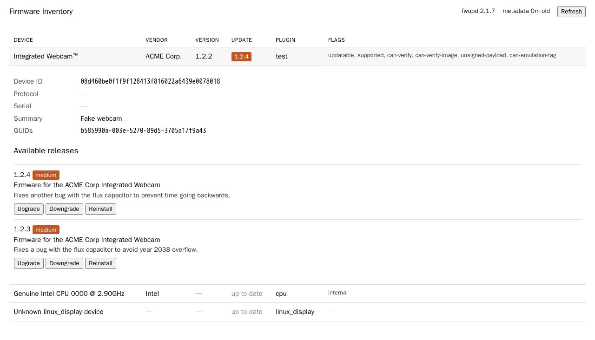
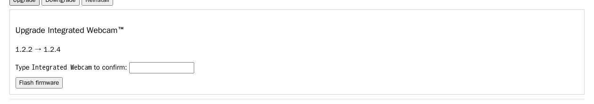

# fwupd-webui

A web UI for [fwupd](https://fwupd.org). It lists every device fwupd can enumerate —
NVMe drives, SATA disks, HBAs, network cards, Thunderbolt controllers, docks, BIOS flash
— with current firmware versions and any updates available from LVFS.

Runs on any Linux host: as a Docker container, as an LXC guest, or natively under
systemd. It started as an Unraid container and is no longer limited to it.

**Flashing is off by default.** Out of the box this is a read-only inventory. Setting
`FWUPD_WEBUI_ENABLE_FLASHING=true` enables the firmware write path; without it the flash
routes are not registered at all.

**It never writes system firmware.** BIOS, UEFI capsule and SPI flash updates are
refused outright, on every deployment target. See [Flashing firmware](#flashing-firmware).



Expanding a row shows its GUIDs, device ID and every available release with changelogs:



Flashing anything means naming it first. There is no one-click path, for any device:



<sub>Screenshots use fwupd's synthetic test device, so the same images render on any
machine.</sub>

## Install

### Docker, anywhere

**No image is published yet** — build it yourself:

```bash
git clone https://github.com/yuzi-co/fwupd-webui.git
cd fwupd-webui
docker build -t fwupd-webui:latest .

docker run -d --name fwupd-webui \
  --privileged \
  -p 8099:8099 \
  -v /sys:/sys \
  -v /dev:/dev \
  -v /run/udev:/run/udev:ro \
  -v fwupd-metadata:/var/lib/fwupd \
  fwupd-webui:latest
```

Or `docker compose up -d` with the bundled [`docker-compose.yml`](docker-compose.yml),
which builds from source.

To run it on a machine that cannot build (an Unraid box, say), build elsewhere and ship
the image over SSH:

```bash
docker save fwupd-webui:latest | gzip -1 | ssh root@HOST 'gunzip | docker load'
```

### Unraid

The template at [`unraid/fwupd-webui.xml`](unraid/fwupd-webui.xml) sets up the mounts,
the port and the flashing toggle. **It expects a published image, which does not exist
yet**, so for now either edit its `<Repository>` to a locally loaded tag, or build
elsewhere and `docker load` onto the box using the SSH one-liner above.

Unraid runs Slackware from a USB stick with the OS in RAM and no persistent package
manager, so a container is the only practical route there.

### Proxmox LXC

Run **on the Proxmox host**:

```bash
bash -c "$(curl -fsSL https://raw.githubusercontent.com/yuzi-co/fwupd-webui/main/deploy/proxmox-lxc.sh)"
```

Creates a privileged Debian LXC, installs into it and starts it. It prompts before
creating anything, and auto-detects your rootfs storage, template storage and
architecture rather than assuming `local-lvm`.

The container reports the firmware of the **Proxmox host**, not of itself — an LXC
shares the host kernel, so `/sys` and `/dev` describe the real machine.

Override any of `CTID`, `CT_HOSTNAME`, `STORAGE`, `TEMPLATE_STORAGE`, `DISK_GB`,
`CORES`, `RAM_MB`, `BRIDGE`, `PORT`, `ENABLE_FLASHING`.

### Debian or Ubuntu, natively

For an existing LXC, a VM or bare metal, with no Docker:

```bash
curl -fsSL https://raw.githubusercontent.com/yuzi-co/fwupd-webui/main/deploy/install.sh | bash
```

Installs to `/opt/fwupd-webui`, runs as a systemd service, configured in
`/etc/fwupd-webui/env`. Re-running it upgrades in place.

```bash
systemctl status fwupd-webui
journalctl -u fwupd-webui -f
```

Note that a native install uses your distribution's fwupd. Debian 13 ships 2.0.20 where
the Docker image ships 2.1.x, which is a device-coverage difference rather than a fault.

## Requirements

**Under Docker, `--privileged` is the requirement.** Everything else is secondary.
Measured on a real host (fwupd 2.1.7, 8 enumerable devices):

| Configuration | Devices found |
| --- | --- |
| `--privileged` | **8** |
| `--cap-add=ALL` + seccomp and AppArmor unconfined + all mounts | 2 |
| all three mounts, not privileged | 2 |
| plain container | 2 |

The two that always appear are the CPU and the display, neither of which needs hardware
access. Nothing short of `--privileged` reaches the disks, and explicit
`--device-cgroup-rule` sets make it worse, not better — see
[Why privileged](#why-privileged).

The bind mounts below are what a privileged container already gets, so under Docker they
are belt-and-braces rather than load-bearing. They are still worth passing: other
runtimes are not Docker, and the Proxmox LXC does need its `/dev` and `/run/udev` binds
declared explicitly.

| Path | Why |
| --- | --- |
| `/sys` | fwupd reads sysfs attributes |
| `/dev` | NVMe, SCSI generic and MTD ioctls |
| `/run/udev` | fwupd's udev database, when the runtime does not provide one |

### Why privileged

Enumerating firmware means talking to hardware: NVMe admin commands, SCSI generic
ioctls, sysfs attributes. That needs privileges a normal container does not have. The
Proxmox LXC is privileged with full device access for the same reason — that is the LXC
equivalent of `--privileged`, and worth treating with the same care as root on the host.

**Narrowing this was attempted and does not work.** Measured against a real host:
`--cap-add=ALL`, seccomp and AppArmor unconfined, and every bind mount still finds only
2 of 8 devices. Adding `--device-cgroup-rule` sets drops it to 0, because specifying
rules replaces Docker's defaults rather than extending them. Whatever `--privileged`
does that matters here is not reachable through capabilities. This is recorded as a
measured dead end rather than a pending improvement.

### Flashing firmware

Disabled unless `FWUPD_WEBUI_ENABLE_FLASHING=true`. When it is off the routes do not
exist — `POST /flash` is a genuine 404, not a handler that refuses.

With it on, four things still stand between a click and a write:

1. **Nothing flashes without typing the device name.** There is no allowlist and no
   one-click path — the same rule applies to a mouse receiver and to your cache drive.
   Matching ignores case, extra whitespace and trademark glyphs, and the UI shows a
   phrase you can actually type; it is a deliberateness check, not a transcription
   test. Storage devices (`nvme`, `ata`, `scsi`, `emmc`) additionally show a prominent
   data-loss warning, so the visual signal distinguishes the dangerous case even though
   the mechanism does not.
2. Confirmation is enforced server-side. The HTML input is a prompt; the server
   refusing the POST is the control.
3. There is no cancel. Killing a flash mid-write can leave partially written
   firmware, so a job runs to completion or fails on its own.
4. **System firmware is refused outright.** `uefi_capsule`, `uefi_dbx` and `mtd` are
   never flashable, whatever else is true of them. The first two stage to the EFI
   system partition; `mtd` writes the SPI flash chip directly, which is how a Proxmox
   host exposed `Internal SPI Controller (BIOS)` as updatable. A failed write there
   costs the motherboard. The Docker image additionally disables `uefi_capsule` in its
   baked fwupd config, but the application enforces this regardless — an LXC or native
   install uses the host's fwupd configuration, where those plugins are live.

The design started with an allowlist of plugins that could flash in one click. It was
wrong twice — most memorably by making a NAS cache pool, the drive Docker runs from,
easier to flash than the array disks. Classifying 124 fwupd plugins by risk is a
judgement that has to be right every time; requiring one confirmation always is a rule
that cannot be got wrong.

**Storage devices.** The hazard is not which plugin drives a disk, it is that the disk
holds data something is using. On a NAS the `ata` devices are usually the array and the
`nvme` is usually the cache pool — which is where Docker itself lives. All storage is
therefore treated as the dangerous case regardless of plugin. Stop the array or unmount
the device before flashing it.

**Staged firmware.** Most devices report `needs-reboot`, meaning the firmware is
written but becomes live only after a reboot. The result screen says which happened,
by re-reading the device after the flash. This tool never reboots the host.

**Leaving it on.** Nothing expires the flag. Turning it off again is a container
restart, and that is the only thing keeping the outermost control meaningful.

## Monitoring

`GET /api/status` returns everything a check needs in one request. Always available,
regardless of whether flashing is enabled.

```bash
curl -s http://host:8099/api/status | jq
```

```json
{
  "status": "ok",
  "fwupd_version": "2.1.7",
  "flashing_enabled": false,
  "devices": { "total": 8, "updatable": 5, "with_updates": 1 },
  "updates": [
    {
      "device_id": "abc123",
      "name": "Samsung SSD 990 PRO",
      "vendor": "Samsung",
      "plugin": "nvme",
      "current_version": "4B2QJXD7",
      "available_version": "5B2QJXD7",
      "urgency": "high",
      "needs_reboot": true
    }
  ],
  "metadata": { "last_refresh": 1786500000.0, "age_seconds": 3600.0, "stale": false, "error": null },
  "flash": null
}
```

`status` is `ok`, `degraded` (metadata stale or a refresh failure) or `error` (fwupd
unreachable, or the last flash failed). The endpoint returns **HTTP 503** when `status`
is `error`, so a plain uptime probe catches a broken fwupd without anyone configuring a
JSON path; `ok` and `degraded` both return 200.

`updates` is always present and is `[]` when there is nothing pending, so a check can
read it unconditionally. `flash` is `null` until a flash has run, then reports phase,
percent and outcome — and unlike the HTML routes it never redirects during a flash.

**Polling.** Enumeration issues real commands to real disks, so responses are cached for
`FWUPD_WEBUI_API_CACHE_SECONDS` (default 60). Polling faster than that is harmless — it
serves the cached snapshot rather than re-reading the hardware.

Useful checks:

```bash
# any firmware updates pending?
curl -s http://host:8099/api/status | jq '.devices.with_updates'

# healthy?
curl -sf http://host:8099/api/status >/dev/null && echo ok || echo unhealthy
```

## Configuration

| Variable | Default | Purpose |
| --- | --- | --- |
| `FWUPD_WEBUI_PORT` | `8099` | Listen port |
| `FWUPD_WEBUI_ENABLE_FLASHING` | `false` | Enables the firmware write path |
| `FWUPD_WEBUI_REFRESH_INTERVAL_HOURS` | `24` | Age above which startup refetches LVFS metadata |
| `FWUPD_WEBUI_TIMEOUT_SECONDS` | `120` | Hard timeout per fwupdtool invocation |
| `FWUPD_WEBUI_INSTALL_TIMEOUT_SECONDS` | `1800` | Hard timeout for a single flash |
| `FWUPD_WEBUI_API_CACHE_SECONDS` | `60` | How long `/api/status` serves a cached snapshot |
| `FWUPD_WEBUI_LVFS_REMOTE` | `lvfs` | `lvfs` or `lvfs-testing` |
| `FWUPD_WEBUI_LOG_LEVEL` | `info` | Log verbosity |

## Troubleshooting

**Only one or two devices listed.** Almost always a missing `--privileged`. A
non-privileged container still finds the CPU and the display, so the UI looks like it is
working while every disk is absent — which is more confusing than an empty list. The UI
has a diagnostic page showing which mounts are visible.

**No devices in an LXC.** Check the udev bind mount landed:
`pct exec <ctid> -- ls /run/udev/data | head`. An unprivileged LXC cannot enumerate
firmware at all — the container must be privileged with device access.

**Metadata is stale.** Refresh failures are non-fatal; the device inventory still
renders. Check that the host can reach `fwupd.org`.

## Development

```bash
make install      # sync dependencies
make test         # unit tests
make lint         # ruff
make image        # build the container
make fixtures     # regenerate test fixtures from real fwupdtool output
make integration  # run tests against real fwupdtool inside the image
```

The README screenshots come from a real browser driving a real container with fwupd's
synthetic test device, not from mockups. Regenerate them by building with
`--build-arg WITH_TEST_DEVICES=true`, running `fwupdtool enable-test-devices` inside it,
and pointing a headless browser at the result. Doing this is worth more than it sounds:
the first pass found three defects that the test suite could not see, because all three
were about what ends up on a screen.

`make fixtures` and `make integration` build the image with
`--build-arg WITH_TEST_DEVICES=true`, which adds the `fwupd-tests` package so
fwupd's synthetic devices are available. The shipped image never includes it.

## Architecture

There is no fwupd daemon in this container. The backend shells out to `fwupdtool`,
which runs the fwupd engine in-process — so the image needs no DBus broker and no
init system, and stays a single Python process.

### Why Debian forky, pinned to a snapshot

This section concerns the **Docker image** only. Native and LXC installs use whatever
fwupd your distribution ships.

The base is `debian:forky-slim` pinned to a `snapshot.debian.org` timestamp. Debian
stable (trixie) carries fwupd 2.0.20 and `trixie-backports` offers nothing newer, so
a current fwupd means leaving stable. Measured on real builds:

| Base | fwupd | Size | Plugins |
| --- | --- | --- | --- |
| `debian:trixie-slim` | 2.0.20 | 503 MB | 132 |
| **`debian:forky-slim`** | **2.1.7** | **472 MB** | **146** |
| `alpine:edge` | 2.1.7 | 331 MB | 144 |
| `alpine:latest` | 2.0.20 | 328 MB | 131 |

Alpine edge reaches the same fwupd in a third less space, but edge has no snapshot
archive — its packages are replaced in place, so an edge build cannot be pinned at
all. forky is testing rather than stable, and its package versions do move, but
pinning an immutable archive timestamp makes that irrelevant: this Dockerfile
resolves to identical packages on any future rebuild. Reproducibility is worth the
141 MB here, and glibc keeps every upstream Linux binary artifact usable, all of
which are glibc-linked.

Two consequences worth knowing:

- **Security updates arrive only when you bump the pin.** That is the cost of a
  frozen archive, and it matters more than usual because the container runs
  privileged. Debian's security team also covers testing more thinly than stable.
- **Bump `DEBIAN_SNAPSHOT` deliberately, then run `make integration`.** That suite
  exercises real `fwupdtool` and is what catches a version bump that changes fwupd's
  JSON output.

```bash
docker build --build-arg DEBIAN_SNAPSHOT=20260810T000000Z -t fwupd-webui:dev .
```

Building fwupd from source was considered and rejected: upstream publishes no Linux
binary (releases carry a Windows MSI and a source tarball), git `main` past 2.1.7 is
158 commits of internal refactor with one new device driver, and pinning a fwupd
commit would still leave its twenty-odd runtime dependencies unpinned.

The `uefi_capsule` plugin is disabled in the baked `/etc/fwupd/fwupd.conf`. That is
the plugin capable of staging a firmware capsule to the EFI system partition, which
on Unraid is the bootable USB stick holding the OS and array configuration. Disabling
it makes read-only a structural property rather than a convention, and an integration
test asserts the plugin reports itself disabled.

## Deployment scripts

- [`deploy/install.sh`](deploy/install.sh) — native Debian/Ubuntu install with a systemd unit
- [`deploy/proxmox-lxc.sh`](deploy/proxmox-lxc.sh) — creates a Proxmox LXC and installs into it
- [`deploy/systemd/fwupd-webui.service`](deploy/systemd/fwupd-webui.service) — the unit itself
- [`unraid/fwupd-webui.xml`](unraid/fwupd-webui.xml) — Unraid Community Applications template
- [`.github/workflows/release.yml`](.github/workflows/release.yml) — GHCR publish, manual dispatch only

## Design documents

- [Phase C design — read-only inventory](docs/specs/2026-08-11-fwupd-webui-design.md)
- [Phase C implementation plan](docs/plans/2026-08-11-fwupd-webui-phase-c.md)
- [Phase A design — flashing](docs/specs/2026-08-12-fwupd-webui-phase-a-design.md)
- [Phase A implementation plan](docs/plans/2026-08-12-fwupd-webui-phase-a.md) — historical; records
  five assumptions that real fwupd and real hardware disproved

## Status

Not yet released. No container image is published, and the version is `0.1.0`
unreleased. Everything here works — both deployment paths that build from source are
verified on real hardware — but installing from a registry is not yet possible.

## License

[MIT](LICENSE)
